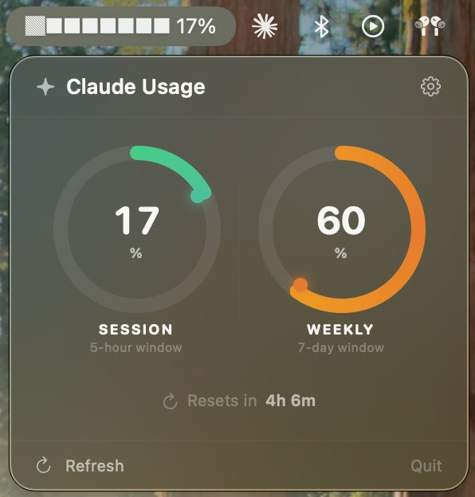
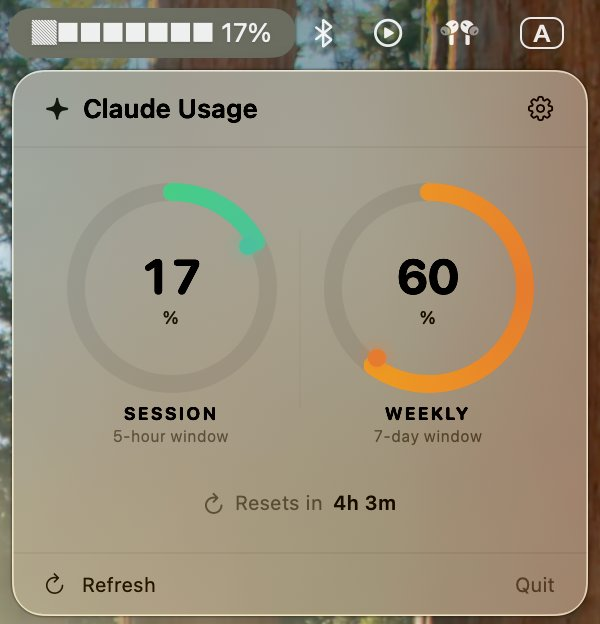

# Claude Usage Status

> A native macOS menu bar app that shows your Claude.ai usage limits in real time — no API key required.

<div align="center">
  
  &nbsp;&nbsp;&nbsp;
  
</div>

---

## What it does

Claude Usage Status sits quietly in your menu bar and shows two progress rings:

| Ring | Window | Data source |
|------|--------|-------------|
| **Session** | 5-hour rolling | `five_hour.utilization` |
| **Weekly** | 7-day cumulative | `seven_day.utilization` |

It also shows a countdown to the next limit reset and adapts instantly to Light and Dark Mode.

---

## Features

- **Zero configuration** — log in once with your Claude account, that's it
- **ASCII progress bar** in the menu bar: `▓▓░░░░░░ 17%`
- **Apple Watch–style circular rings** with animated gradient
- **Dynamic colour** — green → orange → red as usage climbs
- **Monochrome mode** — rings match the system text colour (white/dark)
- **Liquid glass popover** (`.ultraThinMaterial`) that adapts to any wallpaper
- **Settings window** with General and Appearance tabs
- **Launch at Login** via `SMAppService`
- **Auto-polling** every 5 minutes in the background
- **Log Out** clears all session cookies and resets the app

---

## Privacy & Security

> **Your data never leaves your Mac.**

- The app uses a hidden `WKWebView` with the system shared cookie store — the same one Safari uses.
- **No cookies, credentials, or usage data are ever sent to any third-party server.**
- **No analytics. No telemetry. No tracking of any kind.**
- The only network requests are to `claude.ai` — identical to what your browser sends.
- Session cookies are stored locally in the macOS WebKit data store, encrypted at rest by the OS.
- The org UUID is held only in memory and used solely to build the usage API URL.

---

## Requirements

| | |
|---|---|
| **macOS** | 13 Ventura or later |
| **Xcode** | 15 or later (to build from source) |
| **Swift** | 5.9 or later |
| **Third-party dependencies** | **None** — WebKit is built into macOS |

---

## Installation

### Build from source

```bash
git clone https://github.com/yourusername/claude-usage-status.git
cd claude-usage-status
open "Claude Usage Status.xcodeproj"
```

In Xcode: select your signing team → press **⌘R**.

### From a release zip

1. Download `ClaudeUsageStatus.zip` from [Releases](../../releases)
2. Unzip → drag `Claude Usage Status.app` to `/Applications`
3. **Right-click → Open** the first time (Gatekeeper warning for unsigned builds)

---

## First-time Setup

1. Click the menu bar icon (`▓░░░░░░░░ 0%`)
2. Click **Sign In to Claude…**
3. Log in with your Anthropic account in the window that appears
4. The window closes automatically — usage data loads within seconds

You only log in once. The session persists across reboots.

---

## How It Works

```
┌────────────────────────────────────────────────────┐
│                macOS Menu Bar                      │
│              ▓▓░░░░░░░ 17%   ✦                    │
└─────────────────────┬──────────────────────────────┘
                      │ click
                      ▼
┌────────────────────────────────────────────────────┐
│          PopoverView (.ultraThinMaterial)           │
│  ┌─────────────┐    │    ┌─────────────┐           │
│  │ SESSION 17% │    │    │ WEEKLY 60%  │           │
│  │ (5h window) │    │    │ (7d window) │           │
│  └─────────────┘    │    └─────────────┘           │
│          Resets in 4h 6m                           │
└─────────────────────┬──────────────────────────────┘
                      │ every 5 min
                      ▼
┌────────────────────────────────────────────────────┐
│               WebViewManager                       │
│  WKWebView (hidden) → callAsyncJavaScript          │
│  fetch('claude.ai/api/organizations/…/usage')      │
│  ← { five_hour: { utilization: 17.0 }, … }        │
└────────────────────────────────────────────────────┘
```

1. A `WKWebView` pre-loads `claude.ai` at launch to restore the session from disk
2. Cookie polling (`httpCookieStore` every 1.5 s) detects login automatically
3. On each poll, `callAsyncJavaScript` runs an `async fetch()` inside the WebView — session cookies are included automatically
4. JSON is decoded into `UsageData` and published to SwiftUI
5. Rings animate with a spring transition

---

## Customisation

Open **Settings** via the ⚙ gear in the popover header.

### Appearance options

**Menu Bar Icon Style**

| Style | Example |
|-------|---------|
| Full ASCII | `▓▓░░░░░░ 17%` |
| Compact | `17%` |
| Icon Only | `◑` |

**Ring Colour**

| Mode | Behaviour |
|------|-----------|
| Dynamic | Green (0–49%) → Orange (50–79%) → Red (80–100%) |
| Monochrome | Follows system text colour — white in Dark Mode, dark in Light Mode |

---

## Project Structure

```
Claude Usage Status/
├── ClaudeUsageStatusApp.swift   ← @main, MenuBarExtra + Settings scenes
├── AppState.swift               ← ObservableObject: state, polling, auth
├── WebViewManager.swift         ← WKWebView wrapper, JS fetch, cookie poll
├── PopoverView.swift            ← SwiftUI popover + FitnessRing component
├── SettingsView.swift           ← Settings window (General + Appearance tabs)
└── Models.swift                 ← UsageData, MenuBarIconStyle, RingStyle
```

---

## Disclaimer

This is an unofficial third-party app, not affiliated with or endorsed by Anthropic. It reads data from the Claude.ai web interface using your own authenticated browser session.

---

## License

MIT — see [LICENSE](LICENSE).
